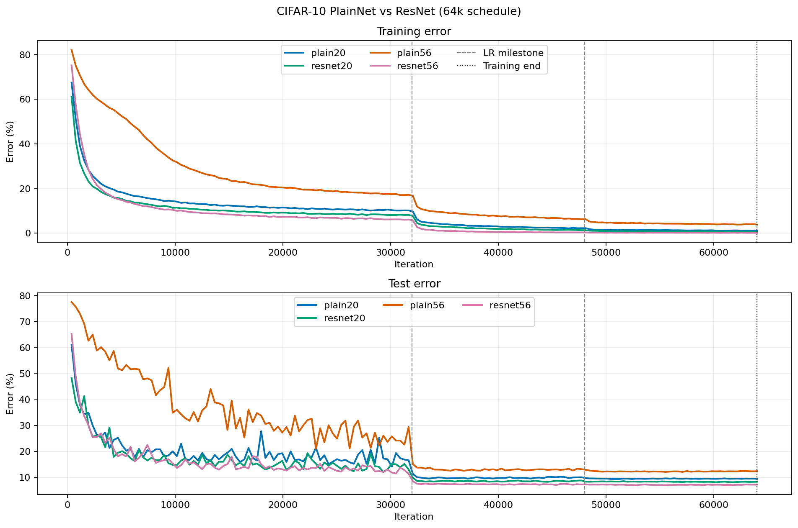
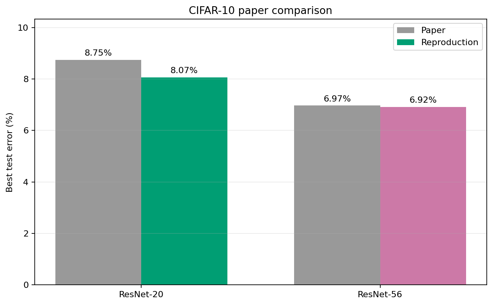

# ResNet 方法实现与 CIFAR-10 复现报告

作者：黄华贵  
日期：2026-07-30  
代码仓库：`hhhhuangggg/resnet-cifar10-reproducti`（Private）

本报告记录一次以学习为目标的ResNet复现。项目不是只调用Torchvision现成模型，
而是从PlainNet baseline开始，独立实现CIFAR ResNet、训练评估闭环和ImageNet
ResNet结构，再通过相同参数量、相同数据与相同训练日程比较plain mapping和
residual learning。正式实验使用CIFAR-10和单个训练seed 42。

## 一、复现目标与学习收获

这次复现主要想解决三个问题。

第一，理解ResNet为什么出现。网络加深理论上不应降低表达能力，因为深层网络
可以用identity mapping模拟浅层网络；但实际优化器往往难以自然找到这种解，
于是深层PlainNet可能连训练集都拟合得更差，这就是论文讨论的退化问题。

第二，亲手走完训练全流程。从图像变成Tensor、数据增强、均值减法、网络前向、
交叉熵、反向传播、SGD更新，到每个epoch的测试、checkpoint、CSV和TensorBoard，
都由本项目代码实际执行。这样能够观察loss从接近随机分类水平逐渐下降，准确率
随训练提高，并理解训练指标和测试指标为什么不同。

第三，用公平实验判断shortcut是否有效。PlainNet和ResNet必须保持相同深度、
卷积主路径、通道数、参数量、初始化、数据处理和训练日程，唯一核心差异是
Residual Block中的shortcut。只有这样，结果差异才能用于分析残差学习。

项目最终完成：

- PlainNet-20/32/44/56和ResNet-20/32/44/56结构；
- PlainNet/ResNet-20、56的5 epoch验证和64k正式训练；
- CIFAR-10自动下载、增强、per-pixel mean和DataLoader；
- checkpoint、断点恢复、CSV、TensorBoard和结果分析；
- ImageNet ResNet-18/34/50/101/152结构与前向传播验证；
- 277项原有自动测试，以及面向干净克隆发布新增的测试。

## 二、ResNet 核心原理

### 2.1 PlainNet baseline

PlainBlock只计算卷积主路径：

```text
y = F(x)
```

它是判断“单纯增加深度是否容易优化”的基线。CIFAR网络使用三个stage，通道数
依次为16、32、64，空间尺寸依次为32×32、16×16、8×8。

### 2.2 Residual Block

Residual Block计算：

```text
y = F(x) + shortcut(x)
```

若目标映射为`H(x)`，主路径学习的是：

```text
F(x) = H(x) - x
H(x) = F(x) + x
```

当理想映射接近identity时，主路径只需把`F(x)`学到接近0，输入仍可通过
shortcut直接传播。shortcut也为反向梯度提供更直接的路径，因此深层网络更容易
优化。每个Residual Block都有shortcut；形状相同使用identity，stage切换时使用
论文CIFAR Option A，通过下采样和通道零填充匹配形状，不增加可训练参数。

### 2.3 层数与参数公平

CIFAR BasicBlock包含两个卷积层，每个stage有`n`个block：

```text
depth = 1 + 3 × (2n) + 1 = 6n + 2
```

| 深度 | 每个stage的block数 | PlainNet参数量 | ResNet参数量 |
|---:|---:|---:|---:|
| 20 | 3 | 269,722 | 269,722 |
| 32 | 5 | 464,154 | 464,154 |
| 44 | 7 | 658,586 | 658,586 |
| 56 | 9 | 853,018 | 853,018 |

相同深度的两种网络参数量一致，因此结果差异不是来自更多可训练参数。

## 三、项目实现过程

项目按由浅入深的方式完成。

1. 建立统一命令行和实验目录，冻结model、seed、batch size、学习率和输出路径；
2. 实现PlainNet并验证20/32/44/56层数、参数量和输出形状；
3. 实现Residual Block、Option A shortcut和四种CIFAR ResNet；
4. 建立CIFAR-10数据管道，训练集做随机裁剪与水平翻转，测试集不做随机增强；
5. 计算训练集`[3,32,32]` per-pixel mean并同时用于训练和测试；
6. 实现单epoch训练和评估，训练阶段启用梯度，测试阶段使用`no_grad`；
7. 增加SGD、学习率日程、checkpoint、断点恢复、CSV和TensorBoard；
8. 先运行1 epoch和5 epoch实验，再执行论文式64k iteration正式训练；
9. 实现结果完整性检查、四模型汇总和论文对比图；
10. 补充ImageNet ResNet-18/34/50/101/152结构，但不下载或训练ImageNet。

核心代码入口：

| 内容 | 文件 |
|---|---|
| CIFAR PlainNet | `models/plainnet.py` |
| CIFAR ResNet与Option A | `models/resnet.py` |
| ImageNet ResNet | `models/imagenet_resnet.py` |
| CIFAR-10数据与预处理 | `data.py` |
| 单epoch训练和评估 | `engine.py` |
| 学习率日程 | `schedules.py` |
| 训练CLI与实验保存 | `train.py` |
| 克隆后结构验证 | `verify_reproduction.py` |
| 正式结果分析 | `analysis/compare_cifar_results.py` |

## 四、实验环境与训练配置

验证环境：

| 项目 | 配置 |
|---|---|
| 操作系统 | Windows 64位 |
| Python | 3.11 |
| PyTorch | 2.5.1+cu121 |
| Torchvision | 0.20.1+cu121 |
| GPU | NVIDIA GeForce RTX 3060 Laptop 6 GB |
| 数据集 | CIFAR-10 |

<!-- pagebreak -->

正式训练协议：

| 项目 | 设置 |
|---|---|
| 模型 | PlainNet-20、ResNet-20、PlainNet-56、ResNet-56 |
| seed | 42 |
| batch size | 128 |
| 优化器 | SGD |
| 初始学习率 | 0.1 |
| momentum | 0.9 |
| weight decay | 0.0001 |
| 总更新次数 | 64,000 iterations |
| 学习率下降 | 32k到0.01，48k到0.001 |
| 测试频率 | 每个epoch一次 |
| 数据增强 | 随机裁剪、随机水平翻转 |
| 输入中心化 | 训练集per-pixel mean |

5 epoch实验只验证网络能够学习和训练链路完整；正式结论只引用64k日程。

## 五、实验结果



图1给出四个模型的训练和测试错误率。灰色虚线是32k和48k学习率下降位置，
黑色点线是64k结束位置。曲线直接来自`history.csv`，没有平滑或插值。

| 模型 | 参数量 | 最佳测试错误率 | 最终训练错误率 | 最终测试错误率 | 总时间 |
|---|---:|---:|---:|---:|---:|
| PlainNet-20 | 269,722 | 9.30% | 1.12% | 9.35% | 62.43分钟 |
| ResNet-20 | 269,722 | 8.07% | 0.61% | 8.23% | 64.00分钟 |
| PlainNet-56 | 853,018 | 12.03% | 3.75% | 12.32% | 92.44分钟 |
| ResNet-56 | 853,018 | 6.92% | 0.06% | 7.13% | 101.21分钟 |

直接差值：

```text
PlainNet加深退化：12.03 - 9.30 = 2.73个百分点
ResNet加深改善：  8.07 - 6.92 = 1.15个百分点
56层shortcut改善：12.03 - 6.92 = 5.11个百分点
```

## 六、结果分析与论文对比



| 模型 | 论文测试错误率 | 本次最佳测试错误率 | 差异 |
|---|---:|---:|---:|
| ResNet-20 | 8.75% | 8.07% | 本次低0.68个百分点 |
| ResNet-56 | 6.97% | 6.92% | 本次低0.05个百分点 |

本次ResNet数值与论文接近，但不能根据单个seed声称稳定优于论文。更重要的证据
是同一实验内部的趋势。

PlainNet-56不仅测试错误率高于PlainNet-20，最终训练错误率也从1.12%上升到
3.75%。如果只是普通过拟合，通常应表现为训练误差更低而测试误差更高；当前
结果说明更深PlainNet本身更难优化。

ResNet-56的训练错误率降到0.06%，测试错误率也低于ResNet-20，说明shortcut
缓解了深度带来的优化困难。相同56层和相同参数量下，ResNet比PlainNet改善
5.11个百分点，是本次复现最直接的残差学习证据。

## 七、从私有 GitHub 仓库复现

仓库保持Private，只有仓库所有者和受邀协作者登录GitHub后才能克隆。

```bat
git clone git@github.com:hhhhuangggg/resnet-cifar10-reproducti.git
cd resnet-cifar10-reproducti
conda env create -f environment.yml
conda activate resnet-paper
```

先验证环境和结构：

```bat
python verify_reproduction.py
python verify_reproduction.py --device cuda --include-imagenet
mkdir .pytest-tmp
python -m pytest -q --basetemp .pytest-tmp\clean-clone
```

首次训练会通过Torchvision自动把CIFAR-10下载到`data/`。1 epoch检查完整链路：

```bat
python train.py --model resnet20 --epochs 1 --run-name clean_clone_smoke
```

5 epoch观察学习：

```bat
python train.py --model plain20 --epochs 5
python train.py --model resnet20 --epochs 5
```

正式训练：

```bat
python train.py --model plain20 --schedule paper
python train.py --model resnet20 --schedule paper
python train.py --model plain56 --schedule paper
python train.py --model resnet56 --schedule paper
```

训练生成的`data/`、`outputs/`、`runs/`和checkpoint不会上传GitHub。仓库保留
汇总CSV和图片，便于不重新训练时检查已有结果。

## 八、局限性与后续工作

当前未完成：

- PlainNet/ResNet-32、44正式训练；
- 多seed实验、均值、标准差和置信区间；
- ResNet-110和ResNet-1202；
- ImageNet训练、top-1/top-5结果和预训练权重；
- 与论文原始框架、硬件和随机数实现的严格等价。

后续若继续，优先顺序应是：补充32/44层形成完整深度曲线；为20/56层增加多个
seed；最后根据算力决定是否训练110层。ImageNet部分当前只证明结构和输出形状
正确，不应写成完成ImageNet论文结果复现。

## 九、结论

这次项目完成了从baseline、模型结构、数据处理、反向传播和实验保存，到正式
训练与结果分析的一次完整闭环。

在固定CIFAR-10、seed 42、相同参数量和统一64k日程下，PlainNet从20层加深到
56层后训练和测试表现同时恶化，复现了论文中的退化趋势；Residual shortcut使
56层网络更容易优化，并获得接近论文的测试错误率。实验说明ResNet的价值不是
简单增加参数，而是通过`F(x)+x`提供更有利的函数参数化和信息、梯度路径。

项目现已具备从Private GitHub仓库克隆、安装、验证、训练、查看日志和重新分析
的完整入口。复现结论仍受单seed和有限深度实验约束，后续扩展必须继续保持公平
对照和明确的结论边界。
